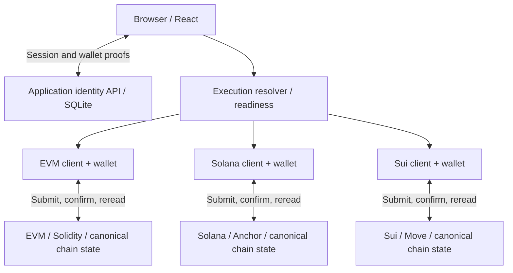

# Multi-Chain Vehicle Marketplace

[](https://github.com/daniel-tsx/web3-marketplace/actions/workflows/ci.yml)

A production-oriented Web3 engineering case study spanning EVM, Solana, and Sui. One application account can link wallets across all three ecosystems, while each marketplace keeps its native asset, custody, payment, and confirmation model. The implementation binds purchases to reviewed listing terms, requires reauthentication for wallet credential changes, and preserves successful execution when subsequent state reads fail.

## What this project demonstrates

- **Shared application identity:** signed wallet proofs establish a UUID account and HttpOnly session; SQLite stores identity, never marketplace settlement.
- **Resource-driven execution:** a vehicle's ecosystem determines the required linked execution wallet, independently of the wallet used to log in.
- **Three native marketplaces:** noncustodial ERC-721 listings on EVM, PDA-controlled SPL escrow on Solana, and shared Listing objects wrapping Vehicles on Sui.
- **Explicit correctness boundaries:** reviewed purchase intent, two-proof wallet linking, and read-only reconciliation retries after successful transactions.

## Architecture



The resolver checks session, wallet linkage, connected address, network, and resource readiness. It never submits transactions. Chain-specific cards and hooks own signing, execution results, and affected reads; the API does not authorize direct chain calls. See [the current system architecture](docs/architecture/multichain-system.md).

## Chain model comparison

| Concern | EVM | Solana | Sui |
| --- | --- | --- | --- |
| Asset model | ERC-721 vehicle | Supply-one SPL vehicle mint | Address-owned Vehicle object |
| Listing state | Contract mapping with persistent version | Persistent Listing PDA with active flag/version | New shared Listing ID per listing |
| Custody while listed | Seller retains NFT; marketplace needs approval | Vehicle token held in listing-PDA escrow ATA | Vehicle wrapped inside Listing |
| Payment authorization | ERC-20 allowance and `transferFrom` | Buyer signer, SPL Token CPI and account constraints | Buyer-controlled `Coin<MUSDC>` input |
| Transaction identifier | Hash | Signature | Digest |
| Purchase-intent binding | Token ID + expected version + maximum price | Expected version + maximum price + configured payment mint | Reviewed Listing ID + exact payment construction |
| Execution / reconciliation | Successful receipt, then contract rereads | Error-free confirmation at `confirmed` commitment, then metadata/account rereads | Successful execution result, then wait/effects and object/balance rereads |

These are different execution models. A submitted identifier alone proves neither execution success nor refreshed ownership.

## Security and correctness invariants

- **Purchase intent (H1):** buyer authorization stays bound to the exact listing generation and terms reviewed. Relisting cannot silently substitute a new purchase; Solana also enforces payment-mint identity. [Intent mechanisms and compatibility](docs/audit-fix-01-purchase-intent.md).
- **Credential changes (H2):** a valid session alone cannot attach a new login wallet. Linking requires fresh authorization from an already-linked wallet and ownership proof from the target wallet, bound to one session and request. [Wallet-link protocol](docs/audit-fix-02-wallet-link-reauthentication.md).
- **Execution vs reconciliation (H3):** successful chain execution remains successful if affected reads fail. Retry state refresh runs only reads and never resubmits a transaction or replaces reviewed terms. [Result and retry boundaries](docs/architecture/trust-boundaries.md#h3-execution-success-is-separate-from-reconciliation-success).

The [trust-boundary document](docs/architecture/trust-boundaries.md) explains which layer enforces each decision and where UI state provides no security guarantee.

## Repository structure

| Path | Responsibility |
| --- | --- |
| `apps/web/` | React catalog, wallet connections, identity UI, execution readiness and native transaction flows |
| `apps/api/` | Fastify/SQLite identity, wallet proofs and sessions |
| `packages/contracts/` | Solidity marketplace, ERC-721/MockUSDC, Foundry tests and local deployment |
| `packages/solana/` | Anchor program, manual TypeScript client, local fixtures and offline/validator suites |
| `packages/sui/` | Move marketplace/scenarios and TypeScript object parsers/transaction builders |
| `docs/` | Current architecture, trust boundaries, setup, verification and implementation references |

## Tech stack

React / Vite / TypeScript · TanStack Query · Wagmi / Viem / RainbowKit · Fastify / Node SQLite · Solidity / Foundry / OpenZeppelin · Solana / Anchor / SPL Token / Wallet Adapter · Sui / Move / Mysten SDK and dApp Kit.

## Verification status

**Locally verified:** EVM Foundry tests, API identity/credential-change tests, frontend execution/reconciliation tests, recursive TypeScript checks, frontend lint/build, API build, Solana offline client tests, and Sui TypeScript builder tests. [Verification evidence and exact commands](docs/operations/verification.md) distinguish these scopes.

**Requires a native toolchain; not runtime-verified on the current Windows host:** Anchor compilation and validator execution, and Sui Move compilation/scenario execution. Offline client tests do not prove either blockchain runtime. Real browser-wallet flows and deployed Sui interaction remain unverified.

[GitHub CI](.github/workflows/ci.yml) checks the reproducible Node/Foundry layers and rejects a generated frontend ABI that differs from the committed artifact. The workflow is locally validated; its first hosted run is pending a push. It does not deploy, seed networks, or run Anchor/Move runtimes.

## Quick start

Use Node 24 and the repository-pinned pnpm 10.26.0. To install and start the identity API with its localhost defaults:

```bat
pnpm install --frozen-lockfile
pnpm api:dev
```

In a second terminal:

```bat
pnpm dev
```

Open `http://localhost:5173`. This starts the frontend and identity service; trading requires chain services and deployed resources. Keep the frontend on port 5173 and use `localhost` consistently for browser/API cookies and Origin checks.

Public browser configuration is described in [apps/web/.env.example](apps/web/.env.example); copy it to `apps/web/.env.local` when configuring chains. [apps/api/.env.example](apps/api/.env.example) describes optional server overrides; the API uses defaults unless variables are exported or explicitly loaded. See [setup and environment loading](docs/operations/verification.md#local-setup-boundaries) for submodules, Foundry, and full chain setup.

## AI-assisted engineering workflow

Codex, Claude Code, and Cursor share a human-reviewed engineering workflow. Project memory lives in source control: [AGENTS.md](AGENTS.md) defines behavior, [AGENT_START_HERE](docs/AGENT_START_HERE.md) routes context, and task-specific documents retain decisions and verification evidence. Chat history is working context rather than the project's source of truth. [AI_WORKFLOW.md](docs/AI_WORKFLOW.md) describes inspection, scoped implementation, review, and verification.

## Documentation

| Read next | Purpose |
| --- | --- |
| [Multichain system](docs/architecture/multichain-system.md) | Current architecture, ownership and chain comparison |
| [Trust boundaries](docs/architecture/trust-boundaries.md) | Identity, custody, authorization and transaction results |
| [Verification and setup](docs/operations/verification.md) | Commands, prerequisites, evidence and runtime limitations |
| [AI workflow](docs/AI_WORKFLOW.md) | Human review and durable project context |
| [EVM reference](docs/run-01-evm-baseline.md), [Solana reference](docs/run-02-auth-solana-multichain.md), [Sui reference](docs/run-03-sui-multichain.md) | Scoped implementation history and chain setup; current H1–H3 docs supersede older cross-cutting descriptions |
| [Documentation index](docs/README.md) | Source-of-truth ownership, task routing and lifecycle |

## Scope and limitations

This is a reference implementation and engineering case study, with no claim of audited production deployment readiness. EVM/Solana deterministic fixtures are local-only and must never be funded on public networks. Sui package and object identifiers require a real deployment. Catalog discovery is intentionally limited to known assets and a single Sui listing slot. A software license remains a human repository-level decision.
