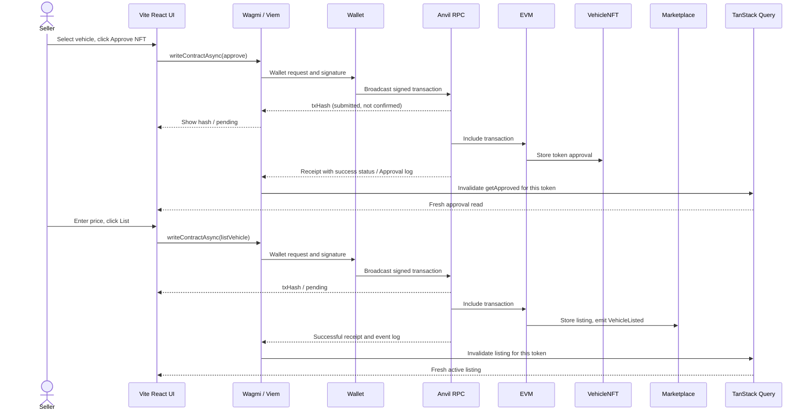
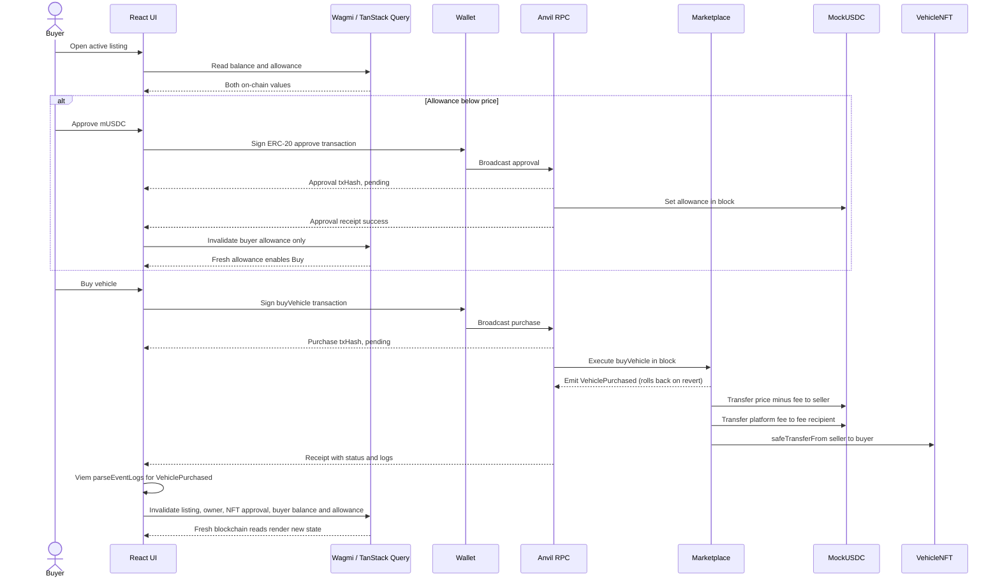

# Run 01: EVM marketplace baseline

Status: **current**. This describes the code in this repository as implemented for local Anvil. The learning objective is to trace a transaction end to end and explain which layer owns each state transition.

## What exists

- `MockUSDC` is an owner-minted ERC-20 with six decimals and no permit.
- `VehicleNFT` is an owner-minted ERC-721; tokens 1, 2, and 3 are seeded with minimal self-contained JSON metadata.
- `VehicleMarketplace` stores noncustodial listings for that collection and payment token. A seller must still own the NFT and authorize the marketplace at purchase time. A new owner can replace an old owner's stale listing. The immutable fee is 250 basis points in the local seed, paid from the listed price to the fee recipient.
- `DeployLocal.s.sol` deploys all three contracts, mints buyer balances, and assigns vehicles to two sellers. It refuses any chain ID except 31337. `scripts/sync-addresses.mjs` reads Foundry's broadcast artifact and writes Vite's `.env.local`; it does not handle private keys. `scripts/export-abis.mjs` extracts ABIs from Foundry build artifacts into one generated TypeScript file.
- The Vite SPA displays three known seed IDs. Its displayed owner, listing, approvals, balance, and allowance are contract reads; the three ID labels themselves are a local seed catalog, not an on-chain enumeration/indexer. RainbowKit is configured for injected browser wallets only, so local practice does not require a WalletConnect project ID.

## Reproduce locally

Install Node.js, pnpm, and Foundry. Clone with submodules or run `git submodule update --init --recursive`, then run `pnpm install` from the root. In separate terminals, run `pnpm anvil` and then `pnpm contracts:build`, `pnpm contracts:test`, `pnpm contracts:deploy`, and `pnpm dev`. Anvil should use its default mnemonic and chain 31337. The deployment uses Anvil's unlocked account 0, so it does not put a key in a browser environment variable. Restart Vite when a new `.env.local` is written. Import Anvil development accounts into a wallet, add chain 31337 with RPC `http://127.0.0.1:8545`, and switch between account 0 (seller 1), account 2 (seller 2), and account 1 (buyer). These are public local development accounts only.

Useful checks: `pnpm contracts:build`, `pnpm contracts:test`, `pnpm typecheck`, `pnpm lint`, `pnpm build`.

## Listing transaction trace

`VehicleCard.tsx` owns the two button handlers and chooses them from `useVehicleState.ts` reads. `useTransactionFlow.ts` sets `wallet` before the wallet request, then `submitted` when Wagmi resolves to a hash, `pending` while Viem waits for the receipt, and `confirmed` only after a successful receipt and targeted query refresh. The approval and listing each require a separate wallet transaction. `VehicleMarketplace.listVehicle` checks ownership and NFT approval again; a disabled frontend button is no security boundary.

## Purchase transaction trace

The allowance must cover the **full listing price**, even though the seller receives price minus fee. `VehicleMarketplace.buyVehicle` marks the listing inactive and emits the marketplace event before external token/NFT calls, then uses OpenZeppelin `SafeERC20` plus `ReentrancyGuard`. A reverted transfer rolls back both the listing change and event log. The tests verify insufficient balance, insufficient allowance, fee split, NFT transfer, inactive listing, and double-purchase protection. Because listings are noncustodial, a seller can transfer the NFT or revoke approval after listing; the contract rechecks both before purchase, and the UI disables buying when its fresh reads detect the issue. Normal contract reads remain the source of current truth after the receipt event is shown.

## State ownership and cache refresh

| Layer | State in this implementation |
| --- | --- |
| Local React | Listing price text input; temporary transaction phase/hash/error in `useTransactionFlow.ts`. |
| Wallet via Wagmi | Account, connection status, current chain, and chain switch in `App.tsx`. |
| Blockchain | NFT owner/approval, listing, mUSDC balance and allowance in `VehicleNFT`, `VehicleMarketplace`, and `MockUSDC`. |
| Wagmi / TanStack Query cache | Local copies of `useReadContract` results in `useVehicleState.ts`. Query keys include contract call arguments, so the connected address selects distinct balance and allowance queries. |

`VehicleCard.tsx` uses each read hook's Wagmi `queryKey` with `queryClient.invalidateQueries({ queryKey, exact: true })`. NFT approval refreshes only `getApproved`; mUSDC approval refreshes only the current account's allowance; list/cancel refresh only that token's listing; purchase refreshes the displayed listing, owner, token approval, buyer balance, and buyer allowance. A successful invalidation refetches active queries. The old cache may be briefly visible between receipt and fresh RPC response, so `confirmed` is set after refresh completes; if refresh itself fails, the UI still reports the receipt as confirmed and displays a separate refresh error. Account or chain changes come from Wagmi's reactive hooks; the card key resets temporary transaction UI for the new wallet context. Cached reads are useful local representations but can become stale from another actor's transaction. They never replace contract validation.

## Transaction terms in this code

| Term | Concrete point in this implementation |
| --- | --- |
| Transaction request | `VehicleCard.tsx` calls Wagmi `writeContractAsync` with ABI, address, function, arguments, account, and chain ID. |
| Wallet confirmation | The injected wallet asks the person to accept or reject the transaction. This is the `wallet` UI stage. |
| Signing / signed transaction | The wallet signs with its own key; the browser app never receives or stores that key. |
| Broadcast | The wallet sends the signed transaction to its RPC. Wagmi's write promise resolves to a hash once submitted. |
| Transaction hash | Identifier displayed at `submitted`/`pending`; it does not prove execution succeeded. |
| Mempool / pending | After hash, before a receipt, `waitForTransactionReceipt` is waiting for block inclusion. Anvil usually mines quickly. |
| Block inclusion | The EVM executes the call in a block, including token transfers and marketplace storage updates. |
| Receipt | Viem's public client returns status and logs to `useTransactionFlow.ts`. |
| Receipt success / revert | `status === 'success'` is required before refreshing reads; a reverted status becomes `failed`. Wallet rejection has its own `rejected` stage. |
| Event logs | `VehicleCard.tsx` filters receipt logs by marketplace address and uses Viem `parseEventLogs` for `VehiclePurchased`. The event is immediate UX evidence, while `ownerOf` remains canonical. |

`errors.ts` recognizes structured Viem wallet rejection, contract revert, insufficient native gas, and RPC errors; the UI's balance/allowance action selection handles detectable payment shortfalls. The original error is retained and logged for local debugging. A wrong chain is handled before rendering transaction buttons. Reverts can still happen after a read if another transaction changes state first.

## Vite vs Next.js for this Web3 frontend

This app starts at `apps/web/src/main.tsx` as a browser-first Vite SPA. Its provider tree is React root → WagmiProvider → TanStack QueryClientProvider → RainbowKitProvider → App. There are no React Server Components, no server/client component boundary, and no built-in backend/API layer. Wallet libraries and `window.ethereum` naturally run in the browser. `apps/web/src/contracts/config.ts` reads `import.meta.env`; Vite exposes only `VITE_*` client variables, so they contain public chain/RPC/address values and never a private key. Vite itself supplies no routing; this one-screen app needs none. There is no SSR hydration path to coordinate here. In a Next.js version, wallet providers and hooks would need an explicit client component boundary, browser-only APIs could not run during server rendering, and hydration/wallet reconnect behavior would need special care. None of those Next.js APIs are used in this repository.

## File trail to study

1. `apps/web/src/main.tsx` — provider ownership and browser entrypoint.
2. `apps/web/src/contracts/config.ts` — Anvil chain, RPC transport, wallet connector setup.
3. `apps/web/src/contracts/addresses.ts` — Vite deployment address boundary.
4. `apps/web/src/web3/useVehicleState.ts` — canonical reads and account-scoped query arguments.
5. `apps/web/src/components/VehicleCard.tsx` — UI action gates, explicit writes, receipt event decoding, targeted invalidation.
6. `apps/web/src/web3/useTransactionFlow.ts` — wallet/hash/pending/receipt/failure stages.
7. `apps/web/src/web3/errors.ts` — structured Web3 error messages.
8. `packages/contracts/src/VehicleMarketplace.sol` — marketplace invariants, fee split, purchase safety.
9. `packages/contracts/src/MockUSDC.sol` and `VehicleNFT.sol` — token primitives and local mint authority.
10. `packages/contracts/test/VehicleMarketplace.t.sol` — executable examples of happy and failure paths.
11. `packages/contracts/script/DeployLocal.s.sol` — deterministic local seed and participant accounts.
12. `scripts/export-abis.mjs` and `sync-addresses.mjs` — Solidity-to-frontend artifact boundary.

For NFT approval, start at `VehicleCard.approveNft`; for listing, `VehicleCard.listVehicle`; for ERC-20 approval, `VehicleCard.approveUsdc`; for purchase, `VehicleCard.buyVehicle`. Follow each call to `useTransactionFlow.run`, then the named Solidity function, receipt, and its specific query keys.

## Future runs (not implemented)

Run 2 may compare EIP-712 signed listings, ERC-2612 permit, or Permit2. Later runs may add backend/indexer synchronization and a multi-chain architecture for EVM, Solana, and Sui. Meta-transactions, relayers, gasless UX, smart accounts/ERC-4337, and deeper marketplace UX remain future study topics. This run stops at the on-chain EVM baseline.
