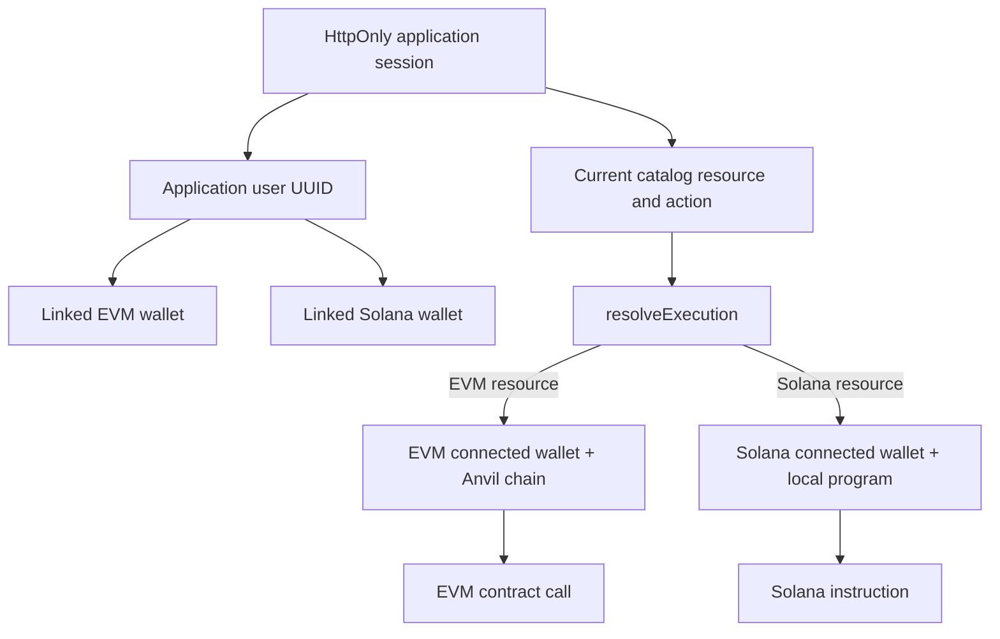
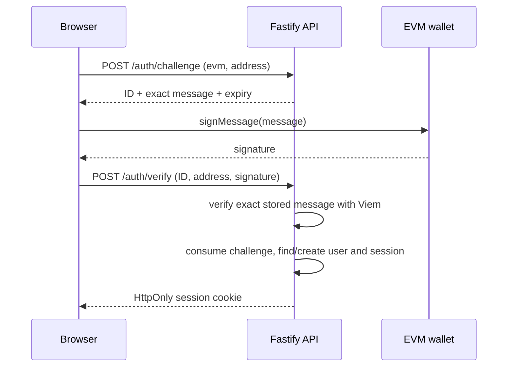
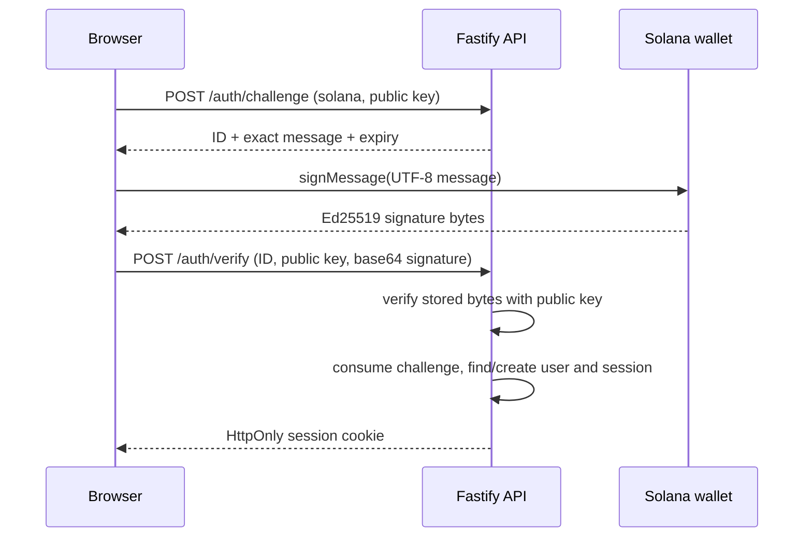
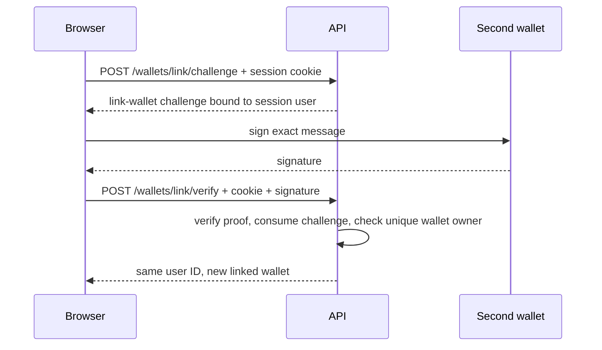

# Run 02: application identity, Solana escrow, and execution context

Status: **current implementation**, with Solana validator/Anchor execution still requiring a WSL toolchain on this Windows host. This guide describes the code in this repository. Run 1's Solidity contracts and transaction flow are preserved.

## 1. Identity is an application decision

An application user is a UUID in `apps/api/src/db.ts`. A successful wallet signature creates or finds that user and creates an opaque session. The wallet used for this login is not saved as a privileged “active chain.” `wallets` stores every wallet that has independently proven ownership for the same user. Wagmi and Solana Wallet Adapter report browser connections; neither connection changes a backend association.



The authentication wallet proves control for one challenge. A linked wallet is a backend wallet-to-user record. A connected wallet is only current browser state. The execution wallet is the connected, linked wallet required by the *current listing's ecosystem*. These may be different at different times. The session persists if either browser wallet changes or disconnects.

`apps/api/src/db.ts` creates four SQLite tables: `users`, `wallets`, `auth_challenges`, and `sessions`. `UNIQUE(ecosystem, address)` prevents one wallet from belonging to two users. EVM addresses are validated with Viem and stored lowercase; Solana keys are validated and stored in canonical base58, preserving case. The backend never stores a wallet private key or marketplace listing.

## 2. Login is a signature, not a connection





`apps/api/src/server.ts` generates 24 random nonce bytes for each challenge. The message binds origin, ecosystem, normalized address, purpose, issue time, and five-minute expiry. Verification ignores any client-supplied message and uses the stored one. A successful verification consumes the challenge inside an SQLite transaction, so replay fails. Sessions use 32 random bytes in a `HttpOnly`, `SameSite=Lax` cookie; only a SHA-256 token hash is stored in SQLite. `POST` requests require the configured frontend `Origin`, and CORS admits that exact origin with credentials. The local cookie has `Secure=false` for HTTP localhost; HTTPS deployment would require `Secure=true` and a separate deployment security review. Wallets without Solana `signMessage` get a clear UI error. Mere connection never creates a session.

`apps/web/src/auth/AccountPanel.tsx` handles signing. `auth/api.ts` uses `credentials: include` and never saves the session token in JavaScript storage. `/me` rehydrates application identity after a page load. `/logout` removes the server session and clears the cookie.

## 3. Linking a second wallet



Linking requires an authenticated session and a fresh signature from the wallet being attached. It does not create a new user. If that wallet is already linked to another user, the API returns `wallet_owned` with HTTP 409. A connection or account switch never silently changes linked wallets.

## 4. Cross-chain execution, end to end

The key exercise: connect a Solana wallet and log in with its signature. The backend gives the browser a session for user UUID **U**. Connect an EVM wallet and choose **Link connected EVM wallet**; its separate signature attaches the EVM address to **U**. Open an EVM vehicle. `App.tsx` passes that EVM resource requirement, **U**'s linked wallets, Wagmi's connected address, and Wagmi's chain ID to `execution/resolveExecution.ts`. The resolver selects EVM regardless of the login wallet. It asks for login, linking, connection, a matching account, or Anvil chain 31337 in that order. On `ready`, `VehicleCard.tsx` runs Run 1's NFT approval, ERC-20 allowance, and `buyVehicle` calls through `useTransactionFlow.ts`. The purchase hash is not treated as success; Viem waits for a successful receipt, parses the `VehiclePurchased` log, and refreshes the affected Wagmi queries. The application session remains **U** throughout.

The reverse works the same way: log in with EVM, link a Solana wallet, open the Solana catalog card, then the resolver selects Solana. `SolanaVehicleCard.tsx` builds the specific Solana instruction and waits for RPC confirmation. `resolveExecution.test.ts` covers both directions plus missing link, missing connection, mismatch, wrong network, and Solana key case sensitivity.

`resolveExecution` is a pure decision function. It never signs or broadcasts. EVM wallet comparisons ignore hexadecimal case, while Solana public keys compare exactly. The Solana `wrong-network` gate means the configured RPC does not expose the deployed local program. Wallet Adapter does not expose a universal injected-wallet cluster field, so the wallet can still reject signing or sending if its own network setting is incompatible; that error stays visible.

## 5. Two intentionally different marketplaces

| Concept | Run 1 EVM | Run 2 Solana |
| --- | --- | --- |
| Identity for execution | `0x` address, chain ID 31337 | base58 public key, local validator RPC |
| Program | Solidity `VehicleMarketplace` contract | Anchor `vehicle_marketplace` program |
| Listing truth | Solidity contract storage | Listing PDA account, seeds `["listing", vehicleMint]` |
| Vehicle | ERC-721 token ID | SPL mint with decimals 0 and supply 1 |
| Payment | Mock ERC-20, six decimals | Mock SPL mint, six decimals |
| Seller listing | NFT stays in seller wallet; marketplace has NFT approval | one token transfers to escrow ATA controlled by listing PDA |
| Buyer permission | ERC-20 allowance to marketplace before purchase | buyer signs transfer instruction; token program checks the buyer's ATA authority |
| Fee | Solidity transfers 250 bps from price | SPL CPI sends 250 bps to fixed local fee recipient ATA |
| Request | Wagmi/Viem `writeContractAsync` | Solana `TransactionInstruction` and wallet adapter `sendTransaction` |
| Submission identifier | transaction hash | transaction signature |
| Completion | receipt status and decoded event logs | RPC confirmation, transaction result/logs, account rereads |

The Solana vehicle token is only a learning model of unique ownership. It has no Metaplex metadata and makes no claim to be a complete NFT product. Its mint and ATA state remain SPL Token accounts. The Anchor program validates decimals, supply, signer and ATA authorities, listing seeds, seller, payment mint, and fee recipient. `list_vehicle` creates a listing PDA and escrow ATA, `cancel_listing` returns the token and closes both accounts, and `buy_vehicle` pays seller and platform via SPL Token CPI, transfers the vehicle to buyer, emits `VehiclePurchased`, and closes listing/escrow. The fixed local fee recipient is deliberately hardcoded for this run; a configurable production treasury is out of scope.

Run 1's noncustodial listing and Solana's escrow listing differ because the account models are different. The EVM contract rechecks seller NFT ownership and approval when buying. The Solana listing owns the one vehicle unit while active, so it cannot be transferred away by the seller. The authentication API owns neither listing.

## 6. Sources of truth and transaction lifecycle

| Source | Canonical data | Cached representation |
| --- | --- | --- |
| SQLite API | User, session, wallet links, challenges | `useSession` TanStack query |
| Anvil EVM | ERC-721 owner/approval, marketplace listing, ERC-20 balance/allowance, receipt | Wagmi query keys in `useVehicleState` |
| Solana validator | mint/ATA balances, listing PDA, escrow, confirmed transaction | `solanaKey` queries in `useSolanaVehicleState` |
| React | Price input, connected wallet hooks, pending transaction phase | Never authoritative for ownership or links |

EVM: `useVehicleState.ts` public reads → `VehicleCard.tsx` wallet write → tx hash → `useTransactionFlow.ts` waits for receipt and checks `status` → affected Wagmi query keys invalidate. Solana: `useSolanaVehicleState.ts` account reads → `SolanaVehicleCard.tsx` builds an instruction → `useSolanaTransaction.ts` asks wallet to sign/send → signature → RPC `confirmTransaction` and `getTransaction` error/log inspection → listing/escrow/owner and payment token query keys invalidate. A signature alone is only submission. A successful confirmation is required before reporting success.

## 7. Local setup and commands

Requirements: Node 24+, pnpm 10+, Foundry, an injected EVM wallet, a Solana wallet supporting message signing, Solana CLI/local validator, Rust, and Anchor CLI **0.32.1**. Clone with submodules (`git clone --recurse-submodules`) or run `git submodule update --init --recursive`. Official [Solana installation](https://solana.com/docs/intro/installation) and [Anchor installation](https://www.anchor-lang.com/docs/installation) instructions require WSL for Windows; install the Solana/Anchor toolchain there. The current Windows host has no WSL, `solana-test-validator`, Rust, or Anchor executable, so the Solana program and validator tests cannot be run here yet. A WSL clone with Node/pnpm installed inside WSL keeps toolchain paths consistent. All chain activity here is localnet/Anvil only.

From the repository root after installing tools:

```sh
pnpm install                 # all JS dependencies
pnpm api:db                  # initialize SQLite schema
pnpm api:dev                 # terminal 1: Fastify on 127.0.0.1:3001
pnpm anvil                   # terminal 2: Anvil on 127.0.0.1:8545
pnpm solana:validator        # terminal 3: Solana localnet on 127.0.0.1:8899
```

Then, from another terminal:

```sh
pnpm contracts:build         # Foundry build and ABI export
pnpm contracts:deploy        # EVM deploy/seed; public addresses to Vite env
pnpm solana:prepare          # write ignored local-only deployer/program key files
pnpm solana:build            # Anchor build with program ID in Anchor.toml
pnpm solana:deploy           # deploy to the running validator
pnpm solana:seed             # local mints, ATAs, buyer funds, escrow listing, Vite env
pnpm dev                     # terminal 4: Vite at http://localhost:5173
```

`solana:prepare` writes keys under ignored `packages/solana/.local` and `target/deploy`, including `.local/seller.json` and `.local/buyer.json`. The deterministic seeds live only in `packages/solana/scripts/local-keys.ts` for local tests. Import the local seller/buyer key only into a development wallet if you want to drive the seeded UI listing; never use those keys on a public chain. `solana:seed` creates a vehicle mint with supply 1, mUSDC mint with six decimals, buyer balance of 100,000 mUSDC, seller/fee token accounts, and an active 12,000 mUSDC escrow listing. Rerunning it does not mint a second vehicle or recreate a listing closed by a market action. After resetting a validator, rerun prepare/build/deploy/seed. Restart Vite after `.env.local` changes. If the EVM deploy writes addresses after Solana seed, `sync-addresses.mjs` preserves the `VITE_SOLANA_*` lines.

The API defaults to `apps/api/.local/auth.sqlite`, initialized automatically on startup as well. Browser requests use `http://localhost:3001` and carry cookies; the API permits only `http://localhost:5173` as Origin. If changing either origin, set `FRONTEND_ORIGIN` for API and `VITE_API_URL` for Vite consistently. For local HTTP on one host, do not mix `localhost` and `127.0.0.1` for the frontend/API cookie site.

Verification:

```sh
pnpm contracts:test          # EVM Foundry tests
pnpm api:test                # in-memory SQLite, signed auth/linking tests
pnpm execution:test          # pure cross-chain resolver tests
pnpm solana:test             # requires running validator and deployed program
pnpm typecheck               # web, API, and Solana TypeScript
pnpm lint                    # frontend ESLint
pnpm build                   # frontend TypeScript and Vite production build
pnpm --dir apps/api build    # API TypeScript production output
```

The Solana test in `packages/solana/tests/vehicle-marketplace.test.ts` creates fresh mints and accounts on localnet. It checks owner listing, escrow transfer, unauthorized cancel, cancel return, non-owner list rejection, insufficient payment, 975/25 seller/fee split on a 1,000 mUSDC price, buyer ownership, account close, and double purchase rejection. These tests require the validator and Anchor deploy; TypeScript typecheck alone does not validate the Rust program.

## 8. Provider hierarchy and study trail

`apps/web/src/main.tsx` installs the browser Buffer polyfill before dynamically loading `bootstrap.tsx`, because SPL Token accesses it during module initialization. The provider tree in `bootstrap.tsx` is React root → WagmiProvider → TanStack QueryClientProvider → RainbowKitProvider → Solana ConnectionProvider → Solana WalletProvider → Solana WalletModalProvider → App. The session is a TanStack query in `auth/useSession.ts`, so it does not need another global provider. Wallet adapters own connection state; the API owns links and login state.

Study these files in order:

| Area | Files |
| --- | --- |
| Authentication | `apps/api/src/db.ts`, `apps/api/src/server.ts`, `apps/api/src/server.test.ts`, `apps/web/src/auth/api.ts`, `apps/web/src/auth/AccountPanel.tsx` |
| Execution | `apps/web/src/execution/resolveExecution.ts`, `apps/web/src/execution/resolveExecution.test.ts`, `apps/web/src/App.tsx` |
| EVM | `apps/web/src/components/VehicleCard.tsx`, `apps/web/src/web3/useTransactionFlow.ts`, `packages/contracts/src/VehicleMarketplace.sol` |
| Solana | `packages/solana/programs/vehicle_marketplace/src/lib.rs`, `packages/solana/src/client.ts`, `packages/solana/tests/vehicle-marketplace.test.ts`, `apps/web/src/components/SolanaVehicleCard.tsx`, `apps/web/src/web3/solana/useSolanaTransaction.ts` |

For **EVM login**, trace `AccountPanel.authenticate('evm')` → `auth/api.ts` → API `/auth/challenge` and `/auth/verify` → `server.ts` Viem verification. For **Solana login**, the same frontend function uses wallet adapter `signMessage`; the API verifies detached Ed25519. For **link second wallet**, trace the link buttons through `/wallets/link/challenge` and `/wallets/link/verify`. For **EVM buy while logged in with Solana**, trace `App.tsx` → `resolveExecution.ts` → `VehicleCard.tsx` → `useTransactionFlow.ts` → Solidity marketplace. For **Solana buy while logged in with EVM**, trace `App.tsx` → resolver → `SolanaVehicleCard.tsx` → `packages/solana/src/client.ts` instruction accounts → `useSolanaTransaction.ts` → Rust program.

## 9. Deliberate local shortcuts and future work

The mixed catalog has three known EVM seed token IDs and one Solana mint address generated by the seed script. These are display metadata, not listing records or an indexer. The Solana client encodes this program's three Anchor discriminators and account layouts explicitly for study rather than generating an IDL-driven client. If the Rust account order or data layout changes, update `packages/solana/src/client.ts` and verify against a compiled/deployed program. The local fee recipient is fixed. SQLite is synchronous and suitable for this small single-process learning API. The cookie configuration and deterministic seed accounts are intentionally local-only. The UI supports the Phantom adapter; wallets lacking `signMessage` cannot log in with Solana.

Run 3 may study Sui, an indexer, richer NFT metadata, signed listings/EIP-712, Permit/Permit2, smart accounts, relayers, gasless UX, production deployment, and stronger operational controls. None are implemented in Run 2.
