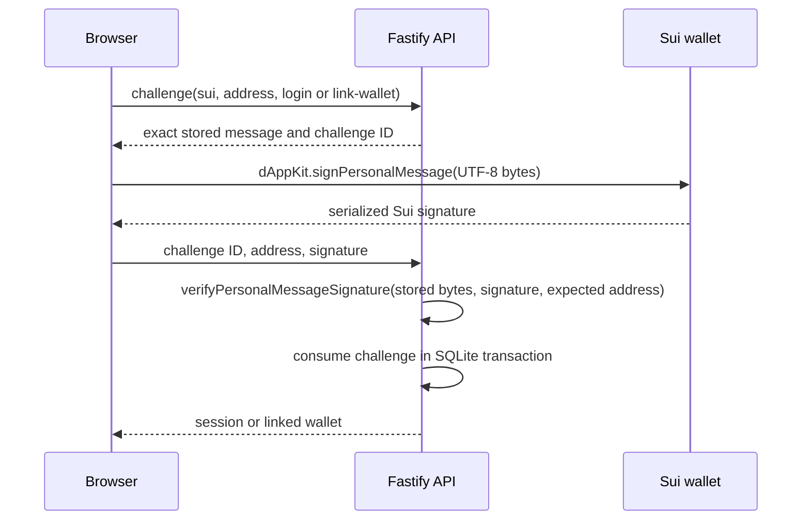

# Run 03: Sui objects in the three-chain marketplace

Status: **implemented for code study; Sui Move build, tests, deployment, and live wallet transactions are unverified on this host**. Run 1 EVM and Run 2 Solana implementations remain in place. This guide describes the code in this repository.

## 1. Why Sui changes the mental model

| | EVM | Solana | Sui |
| --- | --- | --- | --- |
| Code unit | Solidity contract | Anchor program | Move package |
| State model | Contract storage | Explicit accounts | Objects with IDs and ownership |
| Vehicle | ERC-721 token ID | SPL mint, supply one | `Vehicle` object (`UID`) |
| Listing | Storage mapping; NFT stays with seller | Listing PDA plus escrow ATA | Shared `Listing` wraps the `Vehicle`; shared `Market` points to the active listing |
| Payment authorization | ERC-20 allowance then `transferFrom` | Buyer signs SPL Token CPI using ATA authority | Buyer owns coin/balance resources; the transaction constructs an exact `Coin<MUSDC>` input for Move |
| Wallet write | Viem/Wagmi `writeContract` | Wallet Adapter `sendTransaction` | dApp Kit `signAndExecuteTransaction` |
| Identifier | Transaction hash | Transaction signature | Transaction digest |
| Result | Receipt status and logs | RPC confirmation, metadata and logs | Discriminated execution result, effects and events |
| Event/log model | Solidity event logs in receipts | Program logs and Anchor events | Move events plus object/balance effects |
| Frontend refresh | Relevant Wagmi queries | Relevant PDA/ATA queries | Relevant object/balance queries after `waitForTransaction` |

`packages/sui/move/sources/vehicle.move` defines an address-owned `Vehicle`. The publisher holds `MintCap` for development seeding. `musdc.move` creates a six-decimal `MUSDC` and gives the publisher its `TreasuryCap`; only cap holders can mint. `marketplace.move` creates one shared `Market` at publish time. The Market stores the fee recipient (publisher) and one current listing ID. `list` consumes a seller-owned Vehicle input and puts it inside a newly shared `Listing`. The Vehicle's ID remains part of the nested object, but the seller cannot independently spend it while listed. `cancel` extracts it and transfers it back; `buy` extracts it and transfers it to the buyer. The Listing remains shared with an empty Vehicle option after closing, so a second purchase aborts. Sui validates sender ownership of the Vehicle input to `list`; the marketplace checks seller identity for cancel, rejects self-purchase, validates the Market/Listing relationship, checks payment, and splits 250 basis points to the fee recipient.

The Market's one listing slot is a deliberate demo discovery shortcut. The UI reads the known Market ID, then follows `current_listing` to the Listing ID. This is not a general catalog indexer. The configured Vehicle ID names the one study asset. Current on-chain objects and balances are canonical; the local catalog name is metadata only.

## 2. Sui authentication and application identity



`apps/api/src/server.ts` shares the Run 2 challenge, session, and wallet-linking endpoints. It normalizes Sui addresses with `isValidSuiAddress` and `normalizeSuiAddress`; it does not use EVM address rules or an Ed25519-only verifier. Purpose, ecosystem, address, expiry, consumption and session user are checked against stored challenge data before verification. Login creates or reuses an application user and session; linking attaches the Sui wallet to the existing session user. Connecting or changing the browser wallet never changes a backend link. SQLite contains only users, sessions, linked wallets and challenges.

`apps/api/src/db.ts` migrates existing Run 2 SQLite files in one transaction by rebuilding the two tables whose ecosystem constraints need widening, copying the rows, and setting `user_version = 3`. `pnpm api:db` invokes this same idempotent migration; no manual deletion is required. `UNIQUE(ecosystem,address)` still means one wallet belongs to at most one user. The migration test preserves Run 2 wallet and session rows.

## 3. Listing and purchase flows

Listing: seller owns the configured Vehicle ID → `SuiVehicleCard` verifies that address ownership in a fresh object read → `buildListVehicleTransaction` passes Market, Vehicle and six-decimal price to `marketplace::list` → wallet signs/executes → failed result is rejected → digest → `waitForTransaction` → effects/events inspection → Market and Vehicle queries invalidate → Market now points to the shared Listing, which contains the Vehicle.

Cancellation: the seller's connected, linked Sui address calls `marketplace::cancel` with the Market and Listing object IDs. Move checks `listing.seller`, extracts the Vehicle, transfers it back, empties the Listing, and clears `Market.current_listing`. After the wait, the card refreshes Market, Listing and Vehicle queries.

Purchase: buyer reads the Listing price and payment balance → `buildBuyVehicleTransaction` uses `tx.coin({ balance: price, type: MUSDC })` to assemble an exact Coin input from buyer-controlled funds → `tx.moveCall` passes Market, Listing and Coin → wallet signs/executes → `FailedTransaction` is checked → digest is captured → `client.waitForTransaction({ digest })` waits for subsequent indexed reads → `getTransaction` exposes effects, events and balance changes → only Market, Listing, Vehicle, buyer, seller and fee-recipient balance queries invalidate. The Move call pays seller 97.5%, fee recipient 2.5%, and transfers the Vehicle to the buyer. Move aborts on insufficient payment, stale/inactive Listing, wrong Market, self-purchase, or an unauthorized object input. No ERC-20 approval exists in this flow.

`useSuiTransaction.ts` records wallet, submitted, confirming, confirmed, rejected and failed phases. A resolved wallet call can contain `FailedTransaction`, so a promise resolution is not success. A digest identifies execution, but the UI cannot claim refreshed canonical state until `waitForTransaction` and the affected object/balance reads complete. Query refresh failures are recorded separately from successful on-chain execution. Raw failures are logged for debugging, and transaction effects/events/balance changes are available in the card's details pane; object reads remain authoritative.

## 4. Shared orchestration and chain-specific code

The application shares identity, signed wallet linking, resource-driven execution requirements, the pure `resolveExecution` status gates, and the high-level read → authorize → submit → confirm → refresh sequence. The resolver does not submit transactions. For Sui it checks session, linked Sui address, connected address, canonical address match, selected network, and configured/readable package and Market. An EVM or Solana login wallet has no privileged role in that decision.

The EVM card retains ERC-721 approval, ERC-20 allowance, contract calls and receipts. The Solana card retains PDA/ATA accounts, instructions, CPI semantics and signatures. The Sui card owns object reads, Move calls, Coin construction, digests and effects. There is no universal transaction executor. `bootstrap.tsx` installs Wagmi → TanStack Query → RainbowKit → Solana connection/wallet/modal → Sui `DAppKitProvider` → App. `web3/sui/config.ts` centralizes one dApp Kit instance and a gRPC client for each selectable network.

### Exact cross-chain trace

EVM login → Sui purchase: `AccountPanel.authenticate('evm')` → API `/auth/verify` → same user UUID → Sui wallet connect and `AccountPanel.authenticate('sui', 'link-wallet')` → API `/wallets/link/verify` → `App.tsx` Sui resource requirement → `resolveExecution.ts` selects the linked and connected Sui address plus network/resources → `SuiVehicleCard.tsx` → `packages/sui/src/client.ts` buy builder → `useSuiTransaction.ts` execution, failure check, digest, wait, effects → targeted keys in `queryKeys.ts` → fresh Sui objects. The session never changes during this purchase.

Sui login → EVM purchase: `AccountPanel.authenticate('sui', 'login')` → API personal-message verification → link EVM wallet with its own challenge → `App.tsx` EVM requirement → the same resolver → unchanged `VehicleCard.tsx` and `useTransactionFlow.ts` → Run 1 Solidity marketplace. The EVM buy implementation does not know how the user logged in.

## 5. Configuration and real team workflow

Frontend engineers can integrate against a package already deployed to a shared testnet by blockchain engineers. They need the network, gRPC endpoint, published package ID, shared Market object ID, known demo Vehicle ID, payment Coin type, Move function signatures, and a seeded owner/buyer balance. A local Sui validator and Move CLI help develop and test the package, but are not inherently required to run the frontend against a deployed testnet package.

Set these public values in `apps/web/.env.local`, using IDs from the actual publish/seeding transaction effects:

```dotenv
VITE_SUI_NETWORK=testnet
VITE_SUI_RPC_URL=https://fullnode.testnet.sui.io:443
VITE_SUI_PACKAGE_ID=0x...
VITE_SUI_MARKETPLACE_OBJECT_ID=0x...
VITE_SUI_VEHICLE_OBJECT_ID=0x...
VITE_SUI_PAYMENT_COIN_TYPE=0x...::musdc::MUSDC
```

The Coin type defaults to `<package ID>::musdc::MUSDC` if omitted. These are public identifiers, never a private key. Restart Vite after changing environment values. The default testnet endpoint gives the frontend a client, but transaction actions remain gated until the package, Market and Vehicle IDs are provided and the package/Market can be read. The testnet buyer needs SUI gas and seeded mock payment coins; the seller needs the address-owned Vehicle. Publishing or minting on testnet is a separate blockchain-engineer step, not performed by Vite or the API. A package upgrade that changes Move layout requires updating the manual BCS parsers in `packages/sui/src/client.ts` and repeating Move/TypeScript checks.

The execution gate compares the configured network with dApp Kit's selected network. A wallet can still reject an unsupported network or operation when asked to sign; that wallet error remains visible rather than being converted into a successful transaction.

## 6. Commands and verification

```sh
pnpm install                      # workspace dependencies
pnpm api:db                         # idempotent Run 2 → Run 3 SQLite migration
pnpm api:dev                        # API at localhost:3001
pnpm dev                            # Vite at localhost:5173
pnpm anvil                          # separate terminal for Run 1 EVM
pnpm contracts:build && pnpm contracts:deploy
pnpm solana:validator               # separate terminal for Run 2 Solana
pnpm solana:prepare && pnpm solana:build && pnpm solana:deploy && pnpm solana:seed
pnpm api:test && pnpm execution:test && pnpm sui:test
pnpm contracts:test && pnpm solana:test
pnpm typecheck && pnpm lint && pnpm build && pnpm --dir apps/api build
pnpm sui:move:build && pnpm sui:move:test   # requires Sui CLI
```

The Sui Move CLI is unavailable on this Windows host, so the package and Move scenario tests have not been compiled or run. No Sui deployment or wallet transaction was executed here. The TypeScript tests inspect builder object inputs, failure-result handling, and targeted refresh keys; they do not prove Move runtime behavior. `pnpm solana:test` requires its local validator and deployed Anchor program. See Run 1 and Run 2 guides for their local setup.

## 7. Study trail and limits

| Area | Files |
| --- | --- |
| Authentication | `apps/api/src/db.ts`, `apps/api/src/server.ts`, `apps/api/src/server.test.ts`, `apps/web/src/auth/AccountPanel.tsx` |
| Execution | `apps/web/src/execution/resolveExecution.ts`, `resolveExecution.test.ts`, `apps/web/src/App.tsx` |
| EVM | `apps/web/src/components/VehicleCard.tsx`, `apps/web/src/web3/useTransactionFlow.ts`, `packages/contracts/src/VehicleMarketplace.sol` |
| Solana | `apps/web/src/components/SolanaVehicleCard.tsx`, `apps/web/src/web3/solana/`, `packages/solana/src/client.ts` |
| Sui | `packages/sui/move/sources/`, `packages/sui/move/tests/`, `packages/sui/src/client.ts`, `apps/web/src/web3/sui/`, `apps/web/src/components/SuiVehicleCard.tsx` |

SQLite is authoritative for identity, sessions, links and challenges. EVM owns EVM listings, ownership, balances and allowances. Solana owns its Listing PDA, escrow ATA and SPL balances. Sui owns Market/Listing/Vehicle objects and MUSDC balances. React/TanStack Query only caches reads, and wallet libraries only report current connection/signing capability. No chain listing or balance is copied into the API database.

The one Market slot supports one active demo listing; it is an intentional substitute for an indexer, not a production discovery method. The mock coin and vehicle caps are for testnet development seeding. Move runtime behavior, actual wallet compatibility, and a deployed Sui testnet flow remain to be verified with the Sui toolchain and a shared deployment. Possible Run 4 studies include indexing, richer metadata, or deployment operations; none are part of Run 3.
